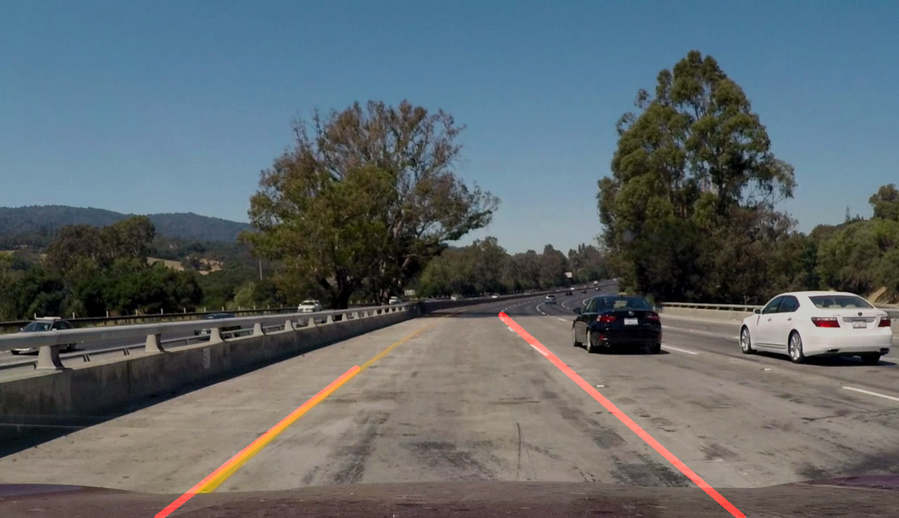

# **Finding Lane Lines on the Road** 

### Description

I constructed an image processing pipeline to draw a single line for each lane using the OpenCV computer vision and numpy Python libraries, and applied this pipeline to video files as image sequences.  My pipeline consists of 7 steps:
* **Conversion to grayscale:** I used OpenCV's image import, which outputs BGR instead of RGB colors.  Thus, the parameter COLOR_BGR2GRAY was used.

* **Gaussian blur:** a larger kernel size of 9 introduced more blur and seemed to help detect small lines by smoothing potential edges.

* **Canny edge detection:** low and high thresholds of 40 and 80 were used, preserving the recommended 1:2 to 1:3 ratio.  I reduced this from 50, 150 to help detect smaller lines.

* **Hough transform:** a 4-vertex trapezoid mask was applied to the image, then edges were converted to lines.  The transform parameters required a great deal of tweaking.

* **Line parsing:** lines were sorted by slope into left and right lanes, rejecting lines with too small (horizontal) a slope.
* **Line reduction:** a new line was constructed using the median slope of all lines in the set (left or right lane), the point (x1, y1) with the smallest y value in the set, and the extrapolated point at the bottom of the image (x2, ymax).

* **Image composition:** the two lines were drawn over the original image and the composite image was returned.

A color selection pass was added in later versions to attempt to improve worst-case output, but ended up reducing overall performance and was not used in the final version.  OpenCV's histogram equalization (http://docs.opencv.org/3.1.0/d5/daf/tutorial_py_histogram_equalization.html) was also added in an attempt to improve contrast prior to processing, but did not appear to produce any improvements.

I ended up choosing less restrictive parameters for both Canny edge detection and Hough transform, in order to improve worst-case output.  This did end up creating additional Hough lines that were not representative of the lane lines, but the final output did not seem to be adversly affected.

---

### Results

While and yellow line detection are demonstrated in the videos below:

The challenge video is also included for completeness:

Attempts to optimize for this video (parameter changes) often degraded performance for the previous videos.  At this point I believe additional modalities will be required to produce the desired output on this video.

---

### Potential Shortcomings

The current pipeline lends itself to some degree of judder of the detected line output.  Generally a lane marking generates two parallel lines, one for each edge detected horizontally.  Currently the pipeline has no way to choose between these lines, and thus may alternate between left and right edges between video frame, producing the apparent judder.  Vertical judder may also appear as new lane line segments are detected and added to the output.

As demonstrated in the challenge video, shadows and low line-to-road contrast exhibit poor performance on some video frames.  While generally the lines are not lost completely, interruptions in line detection could cause the car to shift into an adjacent lane - and that lane may not be empty!

---

### Possible Improvements

I found that without color selection some lines could not be reliably detected, while using it often reduced the quality of the lines returned.  Specifically, simple thresholds or range selections (omit all pixels with blue between 110 and 180 and red less than 220) didn't have the resolution needed to eliminate undesired pixels without eliminating some lane line pixels.  One possible improvement would be to specify better criteria (ex: yellow pixels have a high red to blue ratio, while gray road pixels have a low ratio) and attempt color selection again in order to detect lines with low contrast that Canny/Hough tend to miss.

Another improvement would be to use data from the previous video frame to improve the quality of lines in the current frame.  Since you would not expect solid lines to change drastically from one frame to the next, one way to use past data would be to limit the maximum change in detected lane line slope between video frames.  Appropriate limits would allow for road changes such as intersections yet disallow drastic frame-to-frame variation.
